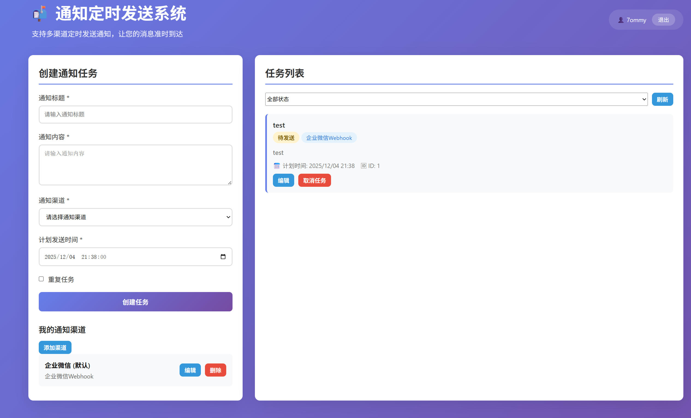

# 通知定时发送系统

基于 [ANotify](https://github.com/TommyMerlin/ANotify) 库的通知定时发送系统，支持多种通知渠道的定时和重复发送。提供完整的 Web 管理界面和 RESTful API。



## 功能特性

- ✅ **多渠道支持**: 企业微信、飞书、钉钉、PushPlus、Server酱等
 - ✅ **多渠道支持**: 企业微信、飞书、钉钉、PushPlus、Server酱，并新增 Gotify、Ntfy、IYUU、巴法云 等第三方推送支持
- ⏰ **定时发送**: 指定时间自动发送通知
- 🔁 **重复任务**: 支持使用 Cron 表达式创建重复任务
- 🌐 **Web 界面**: 美观的前端界面，支持任务的创建、查看、取消
- 🗄️ **任务管理**: 完整的 CRUD 操作
- 📊 **状态跟踪**: 任务状态实时跟踪（待发送、已发送、失败、已取消）
- 🔌 **RESTful API**: 提供完整的 HTTP API 接口
- 🐳 **容器化部署**: 支持 Docker 和 Docker Compose 部署
- 🚀 **生产就绪**: 提供 Nginx、Systemd、Gunicorn 等生产环境配置

## 系统架构

```
┌─────────────────┐
│   Web 前端界面   │  ← 用户交互界面
└────────┬────────┘
         │
┌────────▼────────┐
│   Flask Web API │  ← 提供 RESTful 接口
└────────┬────────┘
         │
┌────────▼────────┐
│   APScheduler   │  ← 定时任务调度
└────────┬────────┘
         │
┌────────▼────────┐
│  Notification   │  ← 封装 ANotify 发送逻辑
│     Sender      │
└────────┬────────┘
         │
┌────────▼────────┐
│     ANotify     │  ← 多渠道通知发送
└─────────────────┘
```

## 📂 项目文件说明

### 核心代码文件

| 文件                | 说明                                      | 重要程度 |
| ------------------- | ----------------------------------------- | -------- |
| `app.py`            | Flask Web 应用主程序，提供 API 和前端服务 | ⭐⭐⭐⭐⭐    |
| `models.py`         | 数据库模型定义，任务数据结构              | ⭐⭐⭐⭐⭐    |
| `scheduler.py`      | 任务调度器，负责定时执行任务              | ⭐⭐⭐⭐⭐    |
| `notifier.py`       | 通知发送器，封装各渠道发送逻辑            | ⭐⭐⭐⭐⭐    |
| `static/index.html` | Web 前端界面                              | ⭐⭐⭐⭐⭐    |

### 配置文件

| 文件                       | 说明                   | 用途           |
| -------------------------- | ---------------------- | -------------- |
| `requirements.txt`         | Python 依赖包列表      | 安装依赖       |
| `gunicorn_config.py`       | Gunicorn 服务器配置    | 生产部署       |
| `nginx.conf`               | Nginx 反向代理配置示例 | 生产部署       |
| `docker-compose.yml`       | Docker Compose 配置    | Docker 部署    |
| `Dockerfile`               | Docker 镜像配置        | Docker 部署    |
| `notify-scheduler.service` | Systemd 服务配置       | Linux 系统服务 |

### 脚本文件

| 文件       | 说明         | 使用场景         |
| ---------- | ------------ | ---------------- |
| `start.sh` | 一键启动脚本 | 快速启动服务     |
| `stop.sh`  | 停止服务脚本 | 停止运行中的服务 |

### 示例和文档

| 文件                   | 说明           | 目标读者 |
| ---------------------- | -------------- | -------- |
| `README.md`            | 完整项目文档   | 所有用户 |
| `DEPLOY.md`            | 快速部署指南   | 运维人员 |
| `example_usage.py`     | API 使用示例   | 开发人员 |
| `test_system.py`       | 系统测试脚本   | 测试人员 |
| `config_examples.json` | 各渠道配置示例 | 配置人员 |

## 快速开始

### 方式一：使用启动脚本（推荐）

```bash
# 1. 克隆或下载项目到服务器
cd /path/to/notify-scheduler

# 2. 运行启动脚本（开发模式）
./start.sh

# 或者使用生产模式（Gunicorn）
./start.sh prod
```

访问 `http://localhost:5000` 即可使用 Web 界面。

### 方式二：手动安装

```bash
# 1. 创建虚拟环境
python3 -m venv venv
source venv/bin/activate

# 2. 安装依赖
pip install -r requirements.txt
pip install gunicorn ANotify

# 3. 初始化数据库
python -c "from models import init_db; init_db()"

# 4. 启动服务（开发模式）
python app.py

# 或使用 Gunicorn（生产模式）
gunicorn -c gunicorn_config.py app:app
```

### 方式三：使用 Docker

```bash
# 1. 构建并启动容器
docker-compose up -d

# 2. 查看日志
docker-compose logs -f

# 3. 停止服务
docker-compose down
```

## Web 界面使用说明

访问 `http://your-server:5000` 打开 Web 管理界面。

### 创建通知任务

1. 在左侧表单中填写通知信息：
   - **通知标题**: 任务标题
   - **通知内容**: 通知正文，支持 Markdown 格式
   - **通知渠道**: 选择发送渠道（企业微信、飞书等）
   - **渠道配置**: 根据选择的渠道填写相应配置（如 Webhook URL）
  - **已保存渠道**: 如果你已在“我的通知渠道”中保存了渠道，可在下拉中直接选择已保存项（下拉样式与其他表单控件一致），选中后会自动填充该渠道的配置字段。
   - **计划发送时间**: 选择发送时间
   - **重复任务**: 勾选后可设置 Cron 表达式创建重复任务

2. 点击"创建任务"按钮

3. 系统会在指定时间自动发送通知

### 管理任务

- **查看任务**: 右侧任务列表显示所有任务
- **筛选任务**: 使用状态筛选器查看不同状态的任务
- **取消任务**: 对于待发送的任务，点击"取消任务"按钮可取消
- **自动刷新**: 任务列表每 30 秒自动刷新

### 渠道管理（前端）

- 在“创建通知任务”表单下方的“我的通知渠道”板块可以添加/管理个人渠道配置。
- 每个渠道项支持 **编辑** 与 **删除** 操作：编辑时会弹出模态框，允许修改渠道名称、配置字段及是否设为默认（渠道类型不可变更以保证安全）。
- 在创建任务时可从“选择已保存的渠道”下拉中快速选择，UI 已优化下拉样式以与表单一致，移动端也增加了触控友好性。

## 生产环境部署

### 使用 Systemd（推荐用于 Ubuntu/Debian）

1. **复制项目到服务器**

```bash
sudo mkdir -p /var/www/notify-scheduler
sudo cp -r * /var/www/notify-scheduler/
cd /var/www/notify-scheduler
```

2. **安装依赖**

```bash
python3 -m venv venv
source venv/bin/activate
pip install -r requirements.txt
pip install gunicorn ANotify
```

3. **配置 Systemd 服务**

```bash
# 复制服务配置文件
sudo cp notify-scheduler.service /etc/systemd/system/

# 重载 systemd
sudo systemctl daemon-reload

# 启动服务
sudo systemctl start notify-scheduler

# 设置开机自启
sudo systemctl enable notify-scheduler

# 查看状态
sudo systemctl status notify-scheduler
```

4. **配置 Nginx（可选但推荐）**

```bash
# 安装 Nginx
sudo apt install nginx

# 复制配置文件
sudo cp nginx.conf /etc/nginx/sites-available/notify-scheduler
sudo ln -s /etc/nginx/sites-available/notify-scheduler /etc/nginx/sites-enabled/

# 修改配置中的域名
sudo nano /etc/nginx/sites-available/notify-scheduler

# 测试配置
sudo nginx -t

# 重启 Nginx
sudo systemctl restart nginx
```

### 使用 Docker Compose

```bash
# 1. 启动服务
docker-compose up -d

# 2. 查看运行状态
docker-compose ps

# 3. 查看日志
docker-compose logs -f notify-scheduler

# 4. 重启服务
docker-compose restart

# 5. 停止服务
docker-compose down
```

### 使用 Docker（单容器）

```bash
# 1. 构建镜像
docker build -t notify-scheduler .

# 2. 运行容器
docker run -d \
  --name notify-scheduler \
  -p 5000:5000 \
  -v $(pwd)/data:/app/data \
  -v $(pwd)/logs:/app/logs \
  notify-scheduler

# 3. 查看日志
docker logs -f notify-scheduler

# 4. 停止容器
docker stop notify-scheduler
```

## API 接口文档

主要接口：
- `GET /` - Web 管理界面
- `POST /api/tasks` - 创建任务
- `GET /api/tasks` - 获取任务列表
- `GET /api/tasks/{id}` - 获取任务详情
- `PUT /api/tasks/{id}` - 更新任务
- `DELETE /api/tasks/{id}` - 取消任务
- `GET /api/channels` - 获取支持的渠道列表

详细 API 文档请查看 `example_usage.py`。

## 项目结构

```
.
├── app.py                      # Flask Web API
├── models.py                   # 数据库模型
├── scheduler.py                # 任务调度器
├── notifier.py                 # 通知发送器
├── static/
│   └── index.html             # Web 前端界面
├── requirements.txt           # Python 依赖
├── gunicorn_config.py         # Gunicorn 配置
├── nginx.conf                 # Nginx 配置示例
├── docker-compose.yml         # Docker Compose 配置
├── Dockerfile                 # Docker 镜像配置
├── notify-scheduler.service   # Systemd 服务配置
├── start.sh                   # 启动脚本
├── stop.sh                    # 停止脚本
├── config_examples.json       # 配置示例
├── example_usage.py           # API 使用示例
├── test_system.py            # 系统测试脚本
└── README.md                  # 项目文档
```

## 支持的通知渠道

具体见 [ANotify](https://github.com/TommyMerlin/ANotify)

| 渠道 | channel 值 | 配置字段 |
|------|-----------|---------|
| 企业微信 | `wecom` | corpid, corpsecret, agentid |
| 企业微信Webhook | `wecom_webhook` | webhook_url |
| 飞书 | `feishu` | appid, appsecret, receiver_type, receiver_id |
| 飞书Webhook | `feishu_webhook` | webhook_url |
| 钉钉Webhook | `dingtalk_webhook` | webhook_url |
| PushPlus | `pushplus` | token |
| Server酱 | `serverchan` | token |
| Gotify | `gotify` | server_url, token |
| Ntfy (ntfy.sh) | `ntfy` | server_url, topic |
| IYUU | `iyuu` | token (可选 `server_url`) |
| 巴法云 | `bafayun` | token (可选 `server_url`) |

详细配置示例请查看 `config_examples.json`。

## 重复任务 Cron 表达式

常用 Cron 表达式示例：
- `0 9 * * *` - 每天早上9点
- `0 */2 * * *` - 每2小时
- `0 9 * * 1` - 每周一早上9点
- `0 0 1 * *` - 每月1号零点
- `*/30 * * * *` - 每30分钟

## 运维管理

### 查看日志

```bash
# Systemd 服务日志
sudo journalctl -u notify-scheduler -f

# Gunicorn 日志
tail -f logs/access.log
tail -f logs/error.log

# Docker 日志
docker-compose logs -f
```

### 重启服务

```bash
# Systemd
sudo systemctl restart notify-scheduler

# Docker
docker-compose restart

# 手动停止和启动
./stop.sh
./start.sh prod
```

### 数据备份

```bash
# 备份数据库
cp notify_scheduler.db notify_scheduler.db.backup

# 使用 cron 定期备份
0 2 * * * cp /var/www/notify-scheduler/notify_scheduler.db /backup/notify_scheduler_$(date +\%Y\%m\%d).db
```

## 安全建议

1. **使用 HTTPS**: 在生产环境中配置 SSL 证书
2. **设置防火墙**: 只开放必要的端口
3. **定期更新**: 及时更新依赖包
4. **备份数据**: 定期备份数据库文件
5. **访问控制**: 配置 Nginx 基本认证或其他认证方式
6. **日志监控**: 定期检查日志文件

## 故障排查

### 服务无法启动

```bash
# 检查端口占用
sudo lsof -i :5000

# 检查日志
tail -f logs/error.log
sudo journalctl -u notify-scheduler -n 50
```

### 通知发送失败

1. 检查任务详情中的错误信息
2. 验证渠道配置是否正确
3. 检查网络连接
4. 查看应用日志

### 数据库错误

```bash
# 重新初始化数据库（会清空数据）
python -c "from models import Base, engine; Base.metadata.drop_all(engine); Base.metadata.create_all(engine)"
```

## 性能优化

1. **调整 Gunicorn workers 数量**: 修改 `gunicorn_config.py`
2. **使用数据库连接池**: 默认已配置 SQLAlchemy 连接池
3. **启用 Nginx 缓存**: 配置静态资源缓存
4. **定期清理旧任务**: 删除过期的已完成任务

## 常见问题

**Q: 如何更改运行端口？**

A: 修改 `gunicorn_config.py` 中的 `bind` 配置或 `app.py` 中的端口设置。

**Q: 支持哪些 Python 版本？**

A: Python 3.8 及以上版本。

**Q: 可以同时运行多个实例吗？**

A: 不建议，因为会导致任务重复执行。如需高可用，建议使用主备模式。

**Q: 如何添加新的通知渠道？**

A: 在 `notifier.py` 中添加新的发送方法，并在 `models.py` 中添加渠道枚举。

## 开发计划

- [x] Web 管理界面
- [ ] 支持通知模板
- [ ] 添加通知发送统计
- [ ] 支持批量操作
- [ ] 添加通知优先级
- [ ] 支持条件触发
- [ ] 多用户权限管理
- [ ] 通知发送历史记录
- [ ] API 认证和限流

## License

MIT License

## 致谢

本项目使用 [ANotify](https://github.com/TommyMerlin/ANotify) 作为通知发送库。
